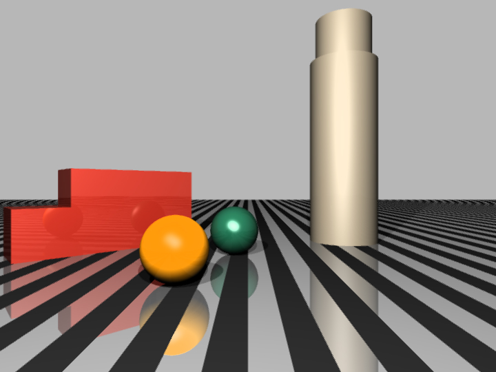
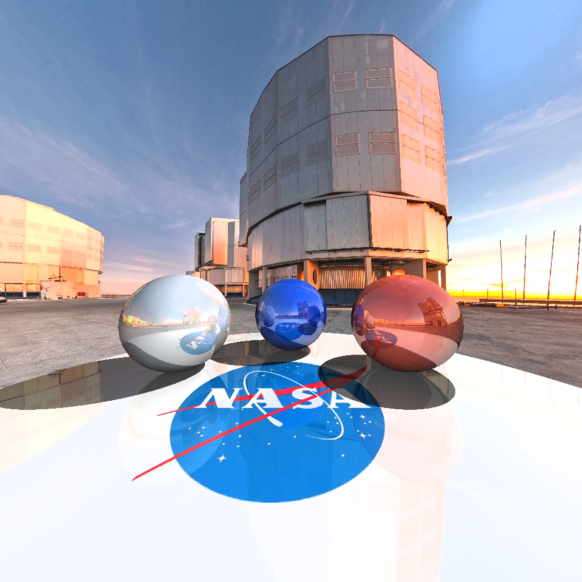

## Ray Tracing

### Ray tracing task requirements
During a Computer Graphics course students of the Computional Mathematics and Cybernetics Faculty of Moscow State University are offered to solve a task on ray tracing algorithm and visualize 1-3 scenes using the algorithm.

Obligatory requiremnts are as following:
1. implementation of local illumination with Phong's model (or others);
2. implementation of shadows;
3. implementation of mirror reflections;
4. using at least 3 different materials ;
5. using at least 2 different geometric primitives ;
6. using at least 1 light source;
7. 1 scene rendering should take no more than 1 second (for processor like 6-cores AMD Ryzen 5 3600);
8. minimal resolution for an image is 512x512.

Students are also offered to perform additional features.

### Scene 1

**Basic primitives:** spheres, cube. \
**Extra features implemented on the scene:**
1. Additional geometric primitives: parallelepiped, plane;
2. 2-order surface: cylinder;
3. Elimination of the straggering effect;
4. Multithreading implementation.

**High resolution version (1920x1080): [scene1_high_resolution.jpg](scene1_high_resolution.jpg)**.

### Scene 2

**Basic primitives**: spheres, plane. \
**Extra features implemented on the scene**:
1. Using environment spheerical maps (observatory);
2. Using textures (NASA logo).

**High resolution version (1920x1920): [scene2_high_resolution.jpg](scene2_high_resolution.jpg)**.

### Run

Solution to the task is written on C++: [ray_tracing.cpp](ray_tracing.cpp). 

To compile the program do: \
**`$ cmake .`** \
**`$ make -j 4`**. 

To run the program do: \
**`$ ./ray_tracing`**.

Following parameters are available: \
**"-out"** --- file to write a result in (should have .jpg format, scene.jpg by default); \
**"-scene"** --- number of scene (1 or 2, 1 by default); \
**"-threads"** --- number of threads (8 by default).

**Example: `$ ./ray_tracing -scene 1 -threads 4 -out "scene1.jpg"`**.
